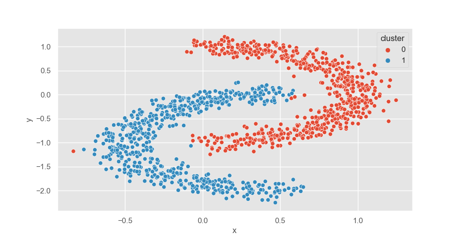

# SpectralNet-PyTorch
PyTorch implementation of SpectralNet .

Implemented affinities:
* rbf kernel 
* nearest neighbor - if the batch is the whole training set.

In order to run on a different dataset and modify hyperparameters, modify main.py.

A tricky hyper-parameter is the epsilon for the Cholesky decomposition, in case Cholesky fails you may want to play with it.

Clustering results on two nested C-shaped clusters with this implementaion, using the rbf kernel:

